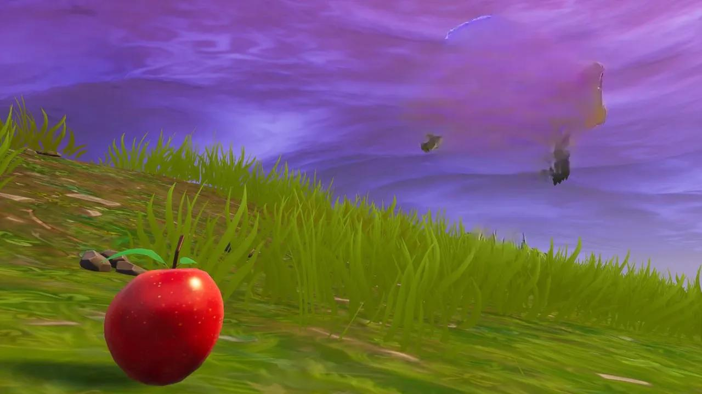

# Task Description
* Set up an express project
* Write an api that will input two files from the user one is source and second is object that would be remove from source image.
* Integrate a free http://phot.ai account with service to call the third-party api Object remove.
* Handle the apis error on your side in a proper format.

# Execution without Docker

- First go the project root and install the dependencies using the command `npm install`.
- setup `.env` file by copying the `.env.example`.
- Run the command `npm run dev` to start the development server.

# Execution with Docker
- Install [Docker](https://www.docker.com/).
- Install [Docker Compose](https://docs.docker.com/compose/).
- Spin up container using command `docker-compose up`

# Features
- Used a scalable and optimized code structure.
- Used axios instance for proper error handling.
- Used [Cloudinary](https://cloudinary.com/) for cloud image storage.
- Used [Swagger](https://swagger.io/) for api documentation.
- Used [Docker](https://www.docker.com/) for containerization.
- Used Rate limiting.

# Api Parameters
### The Body takes two parameters

- `sourceImage` this is the source image which is the actual image.
- `maskImage` it is encoded base64 of traced image object to be removed.

## Sample Base64 Data for test image
- `path: ./sampleBase64.json`

# Output
## Example 1
### Removed the apple from the original image.

- Input image

- Output image

## Example 2
### Removed the tree from the original image.

- Input image

- Output image

